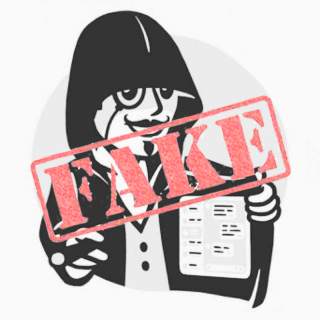

  # Blue Anonymous Bot
  
  # What the hell is this?
  * This is a Fake-Copy of a persian telegram ChatBot called 'برنامه ناشناس'
  * The original idea for the robot came about when we wanted to know who was sending us anonymous messages using 'برنامه ناشناس' bot.
  * SO WE WROTE OUR OWN COPY!
  * (the original bots: @BChatBot - @BiChatbot)

  # How to use it?
  * install java 17
  * clone the repository
  * (OPTIONAL BUT RECOMENDED!) type 'git log' on terminal and check out to the lastest version - that can be seen in commits description - for more stablity.
  * create a telegram bot
    * open telegram
    * text @botfather and create your bot
    * note the token and the username of the bot
  * in resource folder, create 'original_config.properites' file and put the two lines bellow:
      * bot.username=[the username]
      * bot.token=[the token]
  * now just go to out/artifacts/ and run the jar file!
  * make yourself admin
    * for seeing more data directly on telegram, you should set yourself as admin
    * just on the terminal, type 'set admin [your telegram numeric id] true'
      * how to find out your numeric id? just text to the @RawDataBot and note your id.
    * the admins can see more data than normal users. for example they can see who is sending anonymous messages.
    * some special commands defined just for the admins that you can search for them in the source code (on 'command' package!).
  * you can read javadocs to prevents the possible confussions or contact me directly in telegram.
    * at least, read the documention of 'ConsoleReader'. It is necessary for interacting with the bot as an admin.

- fully tested on ubuntu 20.04
